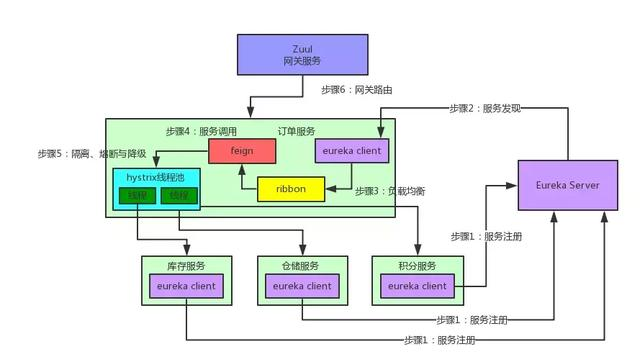

## Spring

**1.开发中主要使用Spring的什么技术?**①.IOC容器管理各层的组件②.AOP配置声明式事务

**2.简述AOP和IOC概念**

AOP的主要编程对象是切面(aspect),而切面模块化横切关注点.可以举例通过事务说明.

IOC:InvertOfControl,控制反转.容器主动地将资源推送给它所管理的组件

**3.在Spring中如何配置Bean?**

通过全类名（反射）、通过工厂方法（静态工厂方法&实例工厂方法）、FactoryBean

**4.IOC容器对Bean的生命周期:**

①.通过构造器或工厂方法创建Bean实例
②.为Bean的属性设置值和对其他Bean的引用
③.将Bean实例传递给Bean后置处理器的postProcessBeforeInitialization方法
④.调用Bean的初始化方法(init-method)
⑤.将Bean实例传递给Bean后置处理器的postProcessAfterInitialization方法
⑦.Bean可以使用了
⑧.当容器关闭时,调用Bean的销毁方法(destroy-method)

**5.Spring如何整合Struts2?**,即由IOC容器管理Struts2的Action

**6.Spring如何整合Hibernate**

整合Hibernate,即由IOC容器生成SessionFactory对象,并使用Spring的声明式事务

**7.SpringMVC比较Struts2**

①.SpringMVC的入口是Servlet,而Struts2是Filter
②.SpringMVC是基于方法设计,而Sturts2是基于类,每次发一次请求都会实例一个Action.
③.SpringMVC使用更加简洁,开发效率SpringMVC确实比struts2高:支持JSR303,处理ajax的请求更方便
④.Struts2的OGNL表达式使页面的开发效率相比SpringMVC更高些.

**8.SpringMVC的运行流程**


**9.说出SpringMVC常用的5个注解**:

@RequestMapping、@PathVariable、@RequestParam、@RequestBoy、@ResponseBody

**10.如何使用SpringMVC完成JSON操作**：

①.配置MappingJacksonHttpMessageConverter
②.使用@RequestBody注解或ResponseEntity**作为返回值**

--------------

## Spring Boot

**1什么是 Spring Boot？**
SpringBoot避免了样板代码和配置。以最少的工作量，更加健壮地使用现有的 Spring 功能。

**2Spring Boot 有哪些优点？**
避免使用 XML。
避免Maven版本冲突
基于环境的配置
通过提供默认值快速开始开发。

**3什么是 JavaConfig？**
可以充分利用 Java 中的面向对象功能,减少或消除 XML 配置。

**4如何重新加载 Spring Boot 上的更改，而无需重新启动服务器？**
DevTools将文件更改自动部署到服务器并自动重启服务器。

**5Spring Boot 中的监视器是什么？**
Spring boot actuator可以帮助访问生产环境中正在运行的应用程序的当前状态。

**6如何在 Spring Boot 中禁用 Actuator 端点安全性？**
management.security.enabled = false

**7如何在自定义端口上运行 Spring Boot 应用程序？**
server.port = 8090

**8什么是 YAML？**
YAML 是1种人类可读的数据序列化语言。它通常用于配置文件。
YAML 文件就更加结构化，而且更少混淆。

**9如何实现 Spring Boot 应用程序的安全性？**
使用 spring-boot-starter-security 依赖项，并且必须添加安全配置。
自定义配置类继承WebSecurityConfigurerAdapter 并重写其方法。

**10如何集成 Spring Boot 和 ActiveMQ？**
使用spring-boot-starter-activemq

**11如何使用 Spring Boot 实现分页和排序？**
使用 Spring Data-JPA 可以实现将可分页的Pageable

**12什么是 Swagger？你用 Spring Boot 实现了它吗？**
Swagger 广泛用于可视化 API

**13什么是 Spring Profiles？**
SpringProfiles 允许用户根据配置文件配置不同环境来注册 bean。

**14什么是 Spring Batch？**
Spring Boot Batch 提供可重用的函数，通过优化和分区技术，可以实现极高批量和高性能批处理作业。

**15什么是 FreeMarker 模板？**
FreeMarker 是1个基于 Java 的模板引擎
使用 Freemarker 的主要优点是表示层和业务层的完全分离。

**16如何使用 Spring Boot 实现异常处理？**
ControlerAdvice 类，来处理控制器类抛出的所有异常。

**17您使用了哪些 starter maven 依赖项？**
spring-boot-starter-activemq/spring-boot-starter-security/spring-boot-starter-web

**18什么是 CSRF 攻击？**
CSRF 代表跨站请求伪造。CSRF 专门攻击状态改变请求,迫使最终用户执行不需要的操作

**19什么是 WebSockets？**
WebSocket 是1种计算机通信协议，通过单个 TCP 连接提供全双工通信信道。

**20什么是 AOP？**
将这些横切关注与业务逻辑分开是面向方面编程（AOP）的地方。

**21什么是 Apache Kafka？**
Apache Kafka 是1个分布式发布 - 订阅消息系统。

**22我们如何监视所有 Spring Boot 微服务？**
Spring Boot 提供监视器端点以监控各个微服务的度量。

-----------------

## Spring Cloud

**1：什么是 Spring Cloud？**
Spring cloud基于 Spring Boot提供与外部系统的集成。

**2：使用 Spring Cloud 有什么优势？**
Spring Cloud可以很好的帮我们处理分布式系统的复杂性比如网络，应用部署，性能，负载均衡等，提供一套解决方案

**3：服务注册和发现是什么意思？Spring Cloud 如何实现？**
由于所有服务都在 Eureka 服务器上注册并通过调用 Eureka 服务器完成查找，无需处理服务地点的任何更改和处理。

**4：负载平衡的意义什么？**
负载平衡旨在优化资源使用，最大化吞吐量，最小化响应时间并避免任何单一资源的过载。

**5：什么是 Hystrix？它如何实现容错？**
Hystrix 是一个延迟和容错库，当出现故障是不可避免的故障时，停止级联故障，实现弹性响应。
可以定义一个fallback类实现相同的接口，当服务不可用时候可以返回默认值

**6：什么是 Hystrix 断路器？我们需要它吗？**
使用 Hystrix 我们定义了一个回退方法。如果在公开服务中发生异常，则回退方法返回一些默认值。

**7：什么是 Netflix Feign？它的优点是什么？**
使用FeignClient指定服务名称，获取URL， 实现客户端负载均衡

**8：什么是 Spring Cloud Bus？我们需要它吗？**
Spring Cloud Bus 提供了跨多个实例刷新配置的功能。
可以通过使用端点/总线/刷新来实现对任何单个实例的刷新。

-----------------

## SpringMVC

**1、什么是SpringMvc？**
答：SpringMvc是spring的一个模块，基于MVC的一个框架。

**2、SpringMVC的优点：**
答：基于组件技术的、不依赖于ServletAPI、视图不仅仅局限于JSP,支持各种请求映射，易于扩展

**3、SpringMVC工作原理？SpringMVC流程？SpringMvc的执行流程？**
1）客户端发送请求到DispatcherServlet
2）DispatcherServlet查询handlerMapping找到处理请求的Controller
3）Controller调用业务逻辑后，返回ModelAndView
4）DispatcherServlet查询ModelAndView，找到指定视图
5）视图将结果返回到客户端

**6、SpringMvc的控制器是不是单例模式,如果是,有什么问题,怎么解决？**
答：SpringMvc的控制器是单例模式,解决方案是在控制器里面不能写字段。

**7、如果你也用过struts2.简单介绍下springMVC和struts2的区别有哪些?**
1）springmvc的入口是一个servlet即前端控制器，而struts2入口是一个filter过虑器。
2）springmvc是基于方法开发(一个url对应一个方法)，请求参数传递到方法的形参，可设计为单例或多例(建议单例)，
struts2是基于类开发，传递参数是通过类的属性，只能设计为多例。
3）Struts采用值栈存储请求和响应的数据，通过OGNL存取数据，
springmvc通过参数解析器是将request请求内容解析，并给方法形参赋值，

**8、SpingMvc中的控制器的注解一般用那个,有没有别的注解可以替代？**
答：一般用@Conntroller注解,不能用用别的注解代替。

**9、@RequestMapping注解用在类上面有什么作用？**
答：是一个用来处理请求地址映射的注解，可用于类或方法上。

**10、怎么样把某个请求映射到特定的方法上面？**
答：方法上加上注解@RequestMapping,在这个注解里面写上要拦截的路径

**11、如果在拦截请求中,我想拦截get方式提交的方法,怎么配置？**
答：可以在@RequestMapping注解里面加上method=RequestMethod.GET

**12、怎么样在方法里面得到Request,或者Session？**
答：方法的形参中声明request,SpringMvc就自动把request对象传入

**13、我想在拦截的方法里面得到从前台传入的参数,怎么得到？**
答：直接在形参里面声明这个参数就可以,但必须名字和传过来的参数一样

**14、如果前台有很多个参数传入,并且这些参数都是一个对象的,那么怎么样快速得到这个对象？**
答：直接在方法中声明这个对象,SpringMvc自动会把属性赋值到这个对象里面

**15、SpringMvc中函数的返回值是什么？**
答：返回值可以有很多类型,有String,ModelAndView

**16、SpringMVC怎么样设定重定向和转发的？**
答：在返回值前面加"forward:"就可以让结果转发,
返回值前面加"redirect:"就可以让返回值重定向,

**17、SpringMvc用什么对象从后台向前台传递数据的？**
答：通过ModelMap对象,把对象加到里面,前台就可以通过el表达式拿到。

**18、SpringMvc中有个类把视图和数据都合并的一起的,叫什么？**ModelAndView。

**19、怎么样把ModelMap里面的数据放入Session里面？**
答：可以在类上面加上@SessionAttributes注解,里面包含的字符串就是要放入session里面的key

**20、SpringMvc怎么和AJAX相互调用的？**
答：通过Jackson框架就可以把Java里面的对象直接转化成Js识别的Json对象。

**21、当一个方法向AJAX返回特殊对象,譬如Object,List等,需要做什么处理？**
答：要加上@ResponseBody注解

**22、SpringMvc里面拦截器是怎么写的**
答：有两种写法,一种是实现接口,另外一种是继承适配器类,然后在SpringMvc的配置文件中配置拦截器即可：

------

服务的提供方把注册注册到eurekaserver

服务的消费方从注册中中心拉去可以使用的服务

然后使用feigion rbiion调用对应的服务

---------

- Eureka：各个服务启动时，Eureka Client都会将服务注册到Eureka Server，并且Eureka Client还可以反过来从Eureka Server拉取注册表，从而知道其他服务在哪里

- Ribbon：服务间发起请求的时候，基于Ribbon做负载均衡，从一个服务的多台机器中选择一台

- Feign：基于Feign的动态代理机制，根据注解和选择的机器，拼接请求URL地址，发起请求

- Hystrix：发起请求是通过Hystrix的线程池来走的，不同的服务走不同的线程池，实现了不同服务调用的隔离，避免了服务雪崩的问题

- Zuul：如果前端、移动端要调用后端系统，统一从Zuul网关进入，由Zuul网关转发请求给对应的服务

----



-----

springcloud与dubbo的区别:http rest与rpc

----

服务降级：某个服务挂了 响应缺省值

服务熔断：当某个服务的响应时间过长 就会中断该服务的调用。当服务可用，重新恢复该服务。

---

**spring切面编程的过程**

1.在配置文件中打开切面开关

2、定义拦截哪些操作类型：比如增加、修改、删除

3、定义拦截操作的切面实现类：

定义统一拦截的切入点，定义方法前后的拦截动作，定义处理异常的动作

--------

----

## 基于JWT Token的身份验证流程

1.客户端使用用户名和密码请求登录
服务端收到请求，验证登录是否成功
验证成功后，服务端会返回一个Token给客户端，反之，返回身份验证失败的信息
客户端收到Token后把Token用一种方式存储到cookie
客户端每次发起请求时都会将Token发给服务端
服务端收到请求后，验证Token的合法性，合法就返回客户端所需数据，反之，返回验证失败的信息

-----

**token的过期方案**

1. token（A）过期设置为15分钟
2. 前端发起请求，后端验证token（A）是否过期；如果过期，前端发起刷新token请求，后端设置已再次授权标记为true，请求成功
3. 前端发起请求，后端验证再次授权标记，如果已经再次授权，则拒绝刷新token的请求，请求成功

-----

**IOC启动过程**

容器启动阶段：加载配置，分析配置信息。装载到beandedinination,实例化对象装载依赖，生命周期回调，对象的其他处理，bean初始化，bean的销毁

**AOP基本运行流程**

方法上添加关注点。
添加被通知的对象Advice。
spring会根据配制文件中配制的切入点去匹配target中方法的调用，从而知道哪些方法需要增加。
当客户端调用这些方法时，直接调用的是代理对象的方法。
AOP通过配制文件中配制的切入点与Advice，从而找到指定方法需要增强的功能。
最终通过代理将Advice动态织入到指定方法。

-----------------------

spring事务的隔离级别

未提交读，已提交读，可重复读，串行化事务

---

spring AOP事务

声明式事务管理建立在AOP之上的。其本质是

对方法前后进行拦截，在目标方法前加入一个事务，在执行完目标方法之后根据执行情况提交或者回滚事务。

基于xml配置文件和基于@Transcational注解

----

### 使用AOP自定义切入实现后端防止表单重复提交

1.自定义防止重复提交标记（@AvoidRepeatableCommit）。
2.对需要防止重复提交的Congtroller里的方法加上该注解。
3.新增Aspect切入点，为@AvoidRepeatableCommit加入切入点。
4每次提交表单时，把key保存到reids（须设置过期时间）。
5重复提交时，判断当前redis是否有该key，若有则拦截。

----

**自定义starter**

添加一个属性配置类xxProperties，添加一个service服务接口给其他服务调用

添加一个自动配置类XXAutoConfiguration，注册该自动配置类到spring.factories

----

zk和eureka的区别(CAP原理)

**zk保证的是一致性和分区容错性,**

**eureka保证的是可用性和分区容错性.**

----

docker常用命令

```shell
##查看docker容器版本
docker version
##查看docker容器信息
docker info
##查看docker容器帮助
docker --help
##列出本地images
docker images
##搜索仓库MySQL镜像
docker search mysql
##下载Redis官方最新镜像，相当于：docker pull redis:latest
docker pull redis
##单个镜像删除，相当于：docker rmi redis:latest
docker rmi redis
##后台启动容器，参数：-d  已守护方式启动容器
docker run -d mycentos
##启动一个或多个已经被停止的容器
docker start redis
##查看redis容器日志，默认参数
docker logs rabbitmq
##显示最近创建容器
docker ps -l
##停止一个运行中的容器
docker stop redis
##杀掉一个运行中的容器
docker kill redis
##删除一个已停止的容器
docker rm redis
```

# Ribbon 和 Feign 的区别

## Ribbon

是一个基于 HTTP 和 TCP **客户端** 的负载均衡的工具。使用 restTemplate 指定 http 请求前缀+具体的请求

## Feign

Feign 是在 Ribbon的基础上进行了一次改进，是一个使用起来更加方便的 HTTP 客户端。

采用接口的方式， **只需要创建一个接口，然后在上面添加注解即可**

@FeignClient(value = "MICROSERVICECLOUD-DEPT")指定服务名称，指定请求地址

----

Nacos整合了注册中心、配置中心功能，可以容器话部署，nacos支持大数量级的集群

------

**springcloud的事务一致性**

服务A和服务B必须参与同一个跨应用的全局事务，并保证二者对应的DB事务必须作为该全局事务的分支事务

明确了该全局事务的完成方向后，再将处理分支事务

**XA机制**，将分成prepare、commit两个阶段.事务管理模块在prepare服务A的DB事务、服务B的DB事务都成功后，再逐个commit这些DB事务。DB在prepare返回OK后，如果没有收到请求则会一直保留该分支事务的数据。

**TCC机制**下，事务管理模块是在服务A、服务B执行完毕后即刻提交其参与的DB事务。如果全局事务决定提交，则逐个提交。

---
**事务几种实现方式**
（1）编程式事务管理对基于 POJO 的应用来说是唯一选择。我们需要在代码中调用beginTransaction()、commit()、rollback()等事务管理相关的方法，这就是编程式事务管理。
（2）基于 TransactionProxyFactoryBean的声明式事务管理
（3）基于 @Transactional 的声明式事务管理
（4）基于Aspectj AOP配置事务

------


Seata 是一款开源的分布式事务解决方案，致力于提供高性能和简单易用的分布式事务服务。Seata 将为用户提供了 AT、TCC、SAGA 和 XA 事务模式，为用户打造一站式的分布式解决方案。

**开启一个全局事务,维护全局事务的运行状态,控制分支事务**

使用@GlobalTransactional注解开启分布式事务：

-----

**动态路由的实现**

网关启动时候 动态加载路由数据。监听动态路由数据源变化，变化时候通知网关刷新路由

